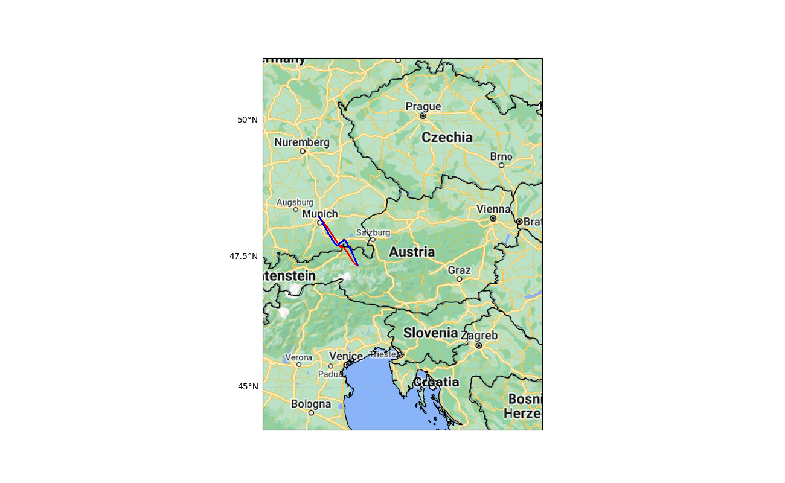

# Crystal Balloon

Crystal balloon is a high altitude balloon flight predictor based on neural network. Predictor is made for project Stardust for scientific circle. A model is able to predict both future flight as well as onging.

Balloons data are downloaded from [sondehub](https://sondehub.org) and forecast data are from open data at [ECMWF](https://www.ecmwf.int)

 Real flight - blue 

 Predicted flight - red

# Setup 

1. Open Anaconda Prompt and navigate into project directory `cd path_to_repo`
2. Run `conda env create`
3. Run `conda activate CB` or set interpreter in your ide

# Usage

## Predictor

To use flight predictor you have to set balloon parameters at the end of predictor.py file. If there isnt forecast data at data/balloon directory script will automaticaly download it. **ECMWF doesn't provide datas older than 2 days.** You can limit number of predictions by setting `limit_prediction` variable and passing it to the predict function. To select trained model you have to fill path in `predictor_config` variable.

## Training

To train your own model firstly you have to prepare dataset. Input data consist of 6 fields: pressure, mass, temp, wind_u, wind_v, deltatime (time difference between frames). Output consist of 3 fields: latitude difference, lontitude difference and altitude difference.

*Note: lat diff and lontitude are scaled up by 100 due to very small values and altitude scaled down by 1000*

There is lack of prepered datasets that is why there is implemented dataset maker. To use it you have to:

1. Download balloons data by sondehub_data_collector.py script. There are 2 ways of doing that: 
    1. You can use `download_data` function which takes number of the balloon from [sondehub website](https://sondehub.org) or date
    2. You can use `collect_data` function which takes number of data you want to download. In that case balloons are selected from recent flights
2. Use dataset_maker.py script to connect sondehub baloons data with forecast data. (You can define how many lines of sondahub_daatas.csv you want to prepare by defining `start` and `finish` variable)

# Author notes

There is huge progress opportunity by giving more input data which influence flight path like mass, used gas and type of balloon. Since sondehub doesnt provide mass it is set to be constant 4kg because of limit by Poland's flight law.